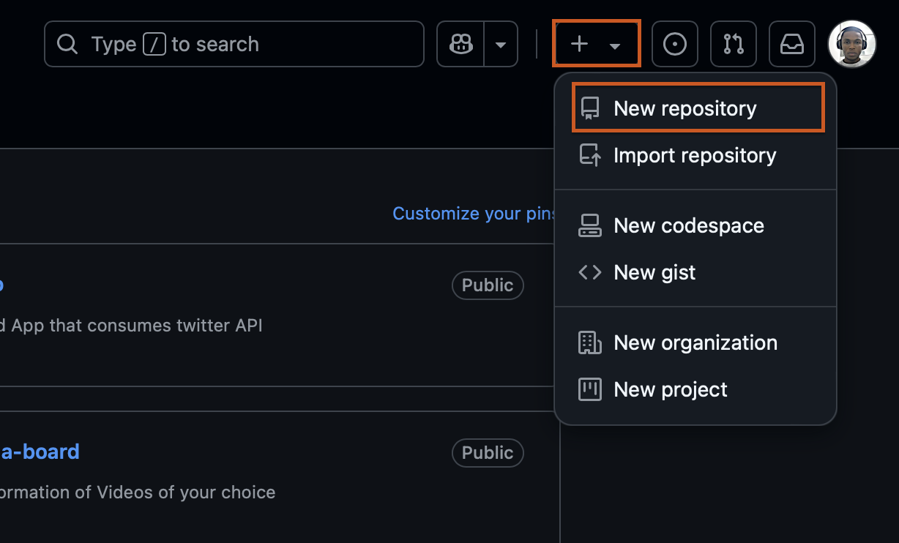
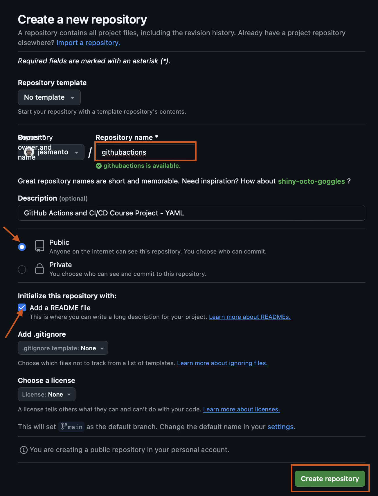
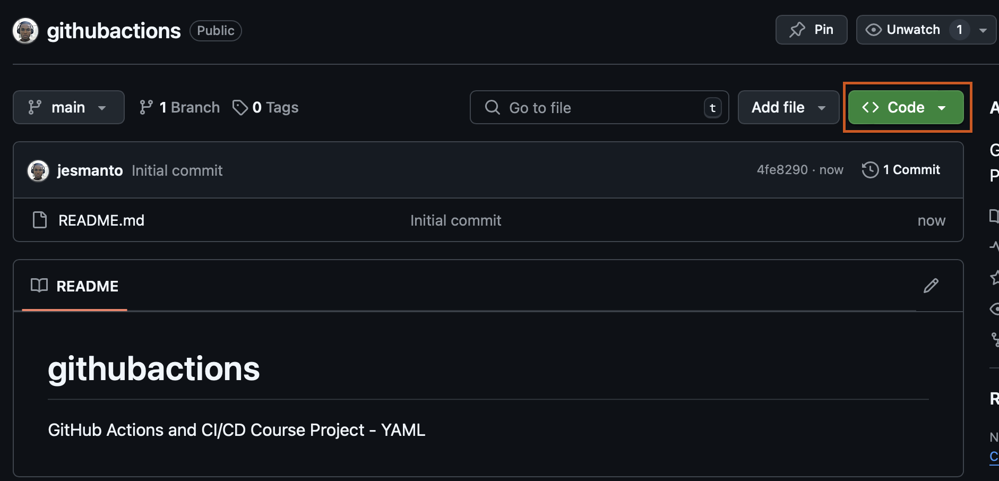
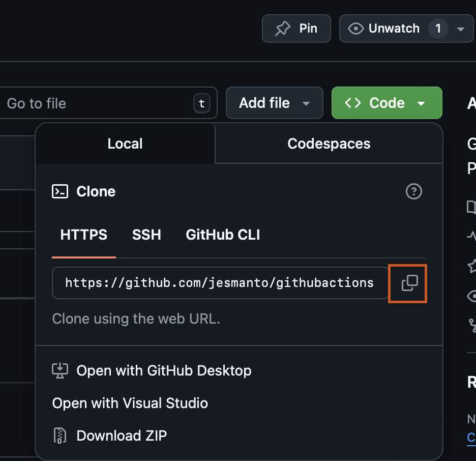
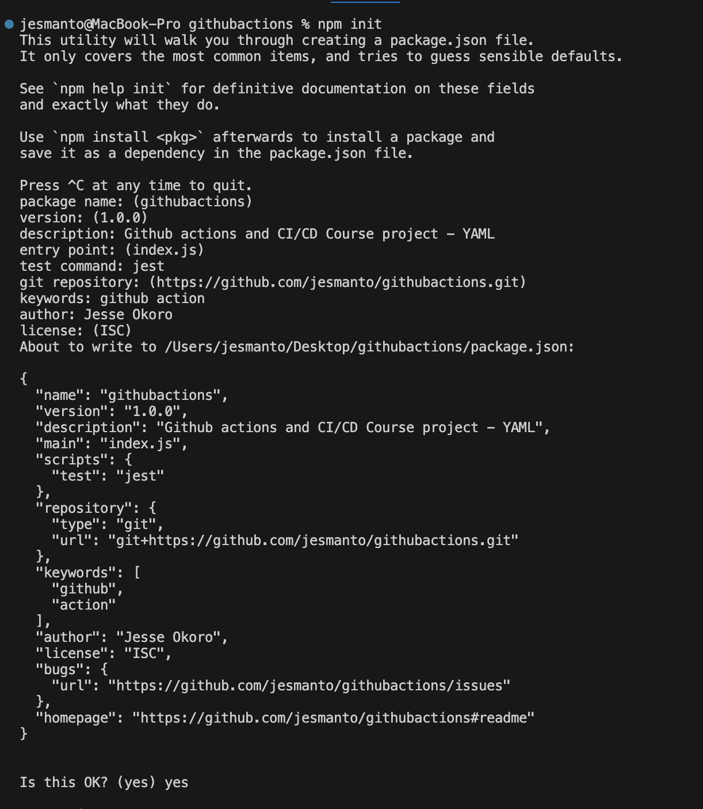

# githubactions
GitHub Actions and CI/CD Course Project - YAML

## Create and clone Github Repository
- To get started, a github account is needed, and it can be created by visiting the [Github Website](http://github.com/join).
- Then install git on your local machine. Visit [Git Installation Guide](https://git-scm.com/book/en/v2/Getting-Started-Installing-Git)
- Login to your git account
- To create a new repository, click on the `+` icon at the the top right corner of the page, and select `New Repository`.
    
- Supply the necessary information about the repository on the creation page. An example is shown below.
    
- Click ont the `Create Repository`.
- On the next page, click on `Code` to see the repository url

    

- Copy the url

    

- Go to your terminal and clone the repository by running command 
    ```
    git clone https://github.com/jesmanto/githubactions.git
    ```

    

## Installing up a Node Application
- Download and install [Node.js](https://nodejs.org/en/download) with the on the website.
- Verify installation by running commands `node -v` and `npm -v` on your terminal.

## Setting up Node.js Application
- Open your VS code terminal
- On the terminal run `npm init` to initialize a node project.
- The package manage prompts you to define the name, version, description and other information about the project.

    

- This process will generate `package.json` file in the project root directory.

## Creating Node.js Application
- Create an index.js using `touch index.js` on the terminal
- Copy the code snippet below in to index.js file.

    ```
    const express = require('express');
    const app = express();
    const port = process.env.PORT || 3000;

    app.get('/', (req, res) => {
    res.send('Hello World!');
    });

    app.listen(port, () => {
    console.log(`App listening at http://localhost:${port}`);
    });

    ```
## Writing Unit Tests
- Create a test file by running `touch actions.test.js` command
- Add a Jest JUnit test for the sample app in the test file

    ```
    const request = require('supertest');
    const app = require('../index');

    describe('API Tests', () => {
        it('responds with "Hello World!"', (done) => {
            request(app).get('/').expect('Hello World!', done);
        });
    });
    ```
- Set up Jest by running `npm install --save-dev jest supertest` command.

## Create Github Environments
To manage dependencies across different environments, follow these steps
- Go to Github Repo
- Navigate to `Settings` tab
- Click on `Environments` on the left hand side
- Click on `New Environment`

    
- Provide the name of the environments and add environment secrets and variables.
- Each environment can have secrets, protection rules, and approval workflows.

    
- Repeat steps 4 and 5 to create for environments `dev` `staging` and `prod`

## Writing Github Actions Workflow to Build and Test the Application
- Create a new directory called `.github`
    ```
    mkdir .github
    ```
- Create another directory called `workflows` as a sub-directory to .github, to achieve a `.github/workflows` file structure.
    ```
    cd .github
    mkdir workflows
    ```
- Create a file named `test.yml` which will contain the workfow.
    ```
    cd workflows
    touch gademo.yml
    ```
### Creating a Parallel & Matrix Workflow
- Give a name to the workflow
    ```
    name: Build and Test Node App CI
    ```
- Specify the event to trigger the workflow. The snippet below shows that the workflow will trigger at a push event to the main branch. This is using the `on` term.
    ```
    on:
        push:
            branches: [main]
    ```

- Define the jobs that the workflow will execute. This part defines the workflow from code integration to code testing
    ```
    jobs:
        build:

            runs-on: ubuntu-latest

        strategy:
            matrix:
                node-version: [14, 16, 18]

        steps:
            - name: Checkout
              uses: actions/checkout@v2

            - name: Use Node.js ${{ matrix.node-version }}
              uses: actions/setup-node@v4
              with:
                node-version: ${{ matrix.node-version }}

            - name: Install dependencies
              run: npm install --save-dev jest supertest express

            - name: Build Application
              run: npm run build --if-present

            - name: Test
              run: npm test

### Explanation
1. `name`: This simply names your workflow. It's wht appears on Github when the workflow is running.
2. `on`: This section defines when the workflow is triggered. Here, it's set to activate on push and pull request events to the main branch.
3. `jobs`: Jobs are a set of steps that execute on the same runner. In example, there's one job named `build`.
4. `runs-on`: Defines the type of machine to run the job on. Here, it's using the latest Ubuntu virtual machine.
5. `strategy.matrix`: This allows you to run the job on multiple versions of Nodejs, ensuring compatibility.
6. `steps`: A sequence of tasks executed as part of the job 

### Implementing parallel and matrix builds
I ran the workflow using three different versions of node versions using matrix strategy, and the jobs were successful.
    

### Creating a Multi-Environment Workflow
- Give a name to the workflow
    ```
    name: Build and Test Node App CI
    ```
- Specify the event to trigger the workflow. The snippet below shows that the workflow will trigger at a push event to the main branch. This is using the `on` term.
    ```
    on:
        push:
            branches: [main]
    ```

- Define the jobs that the workflow will execute. This part defines the workflow from code integration to code testing
    ```
    jobs:
    build:
        name: Build and Run Unit Tests
        runs-on: ubuntu-latest

        environment:
        name: ${{ github.ref == 'refs/heads/main' && 'Prod' || github.ref == 'refs/heads/staging' && 'Staging' || 'Dev' }}

        steps:
        - name: Checkout
        uses: actions/checkout@v2

        - name: Setup Node.js 
        uses: actions/setup-node@v2
        with:
            node-version: ${{ github.ref == 'refs/heads/main' && '18' || github.ref == 'refs/heads/staging' && '16' || '14' }}

        - name: Install dependencies
        run: |
            echo " ${{ vars.STATUS }} " && npm install --save-dev jest supertest express dotenv --only=${{ github.ref == 'refs/heads/main' && 'production' || 'development' }}

        - name: Run tests
        run: npm test
    ```

### Explanation
1. `name`: This simply names your workflow. It's wht appears on Github when the workflow is running.
2. `on`: This section defines when the workflow is triggered. Here, it's set to activate on push and pull request events to the main branch.
3. `environment`: This section defines the environment the 
4. `jobs`: Jobs are a set of steps that execute on the same runner. In example, there's one job named `build`.
5. `runs-on`: Defines the type of machine to run the job on. Here, it's using the latest Ubuntu virtual machine.
6. `steps`: A sequence of tasks executed as part of the job 
7. Conditional statements were used to define the behaviour of the workflow based on the current environment.

## Challenges Faced
I faced so many challenges that caused my workflows to fail, these challenges include:
- Creating repository secret variables.
- Proper indentation of various component
- integrating unit tests


## Lessons Learnt
- I can trigger a workflow with the success status of the previous workflow 
- secrets variables must be stored separately for each repository. This took me 2 hours to figure out, after 16 failures.
- When working with github action yaml files, `name`, `uses` and `run` must be on the same line of indentation.
- Install all necessary dependencies and test your application before pushing to remote repository.